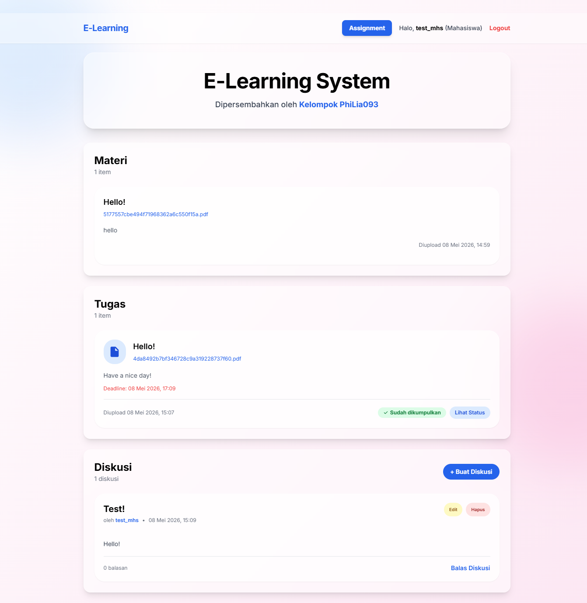
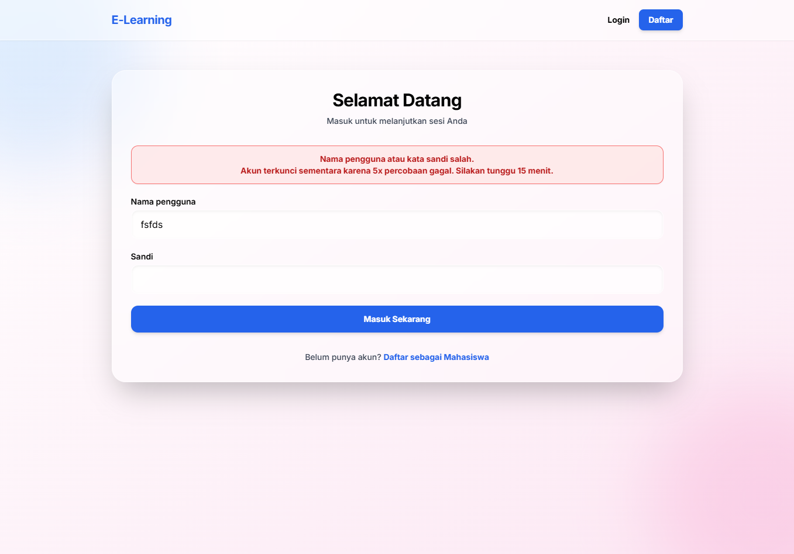
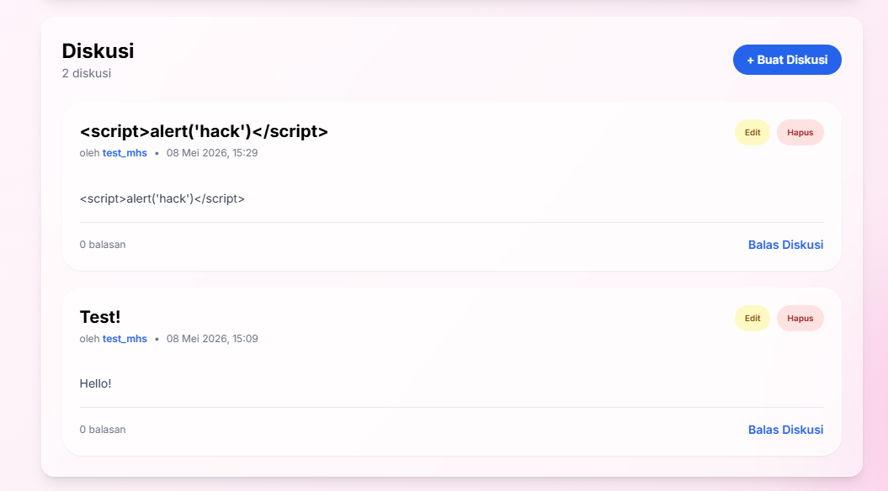
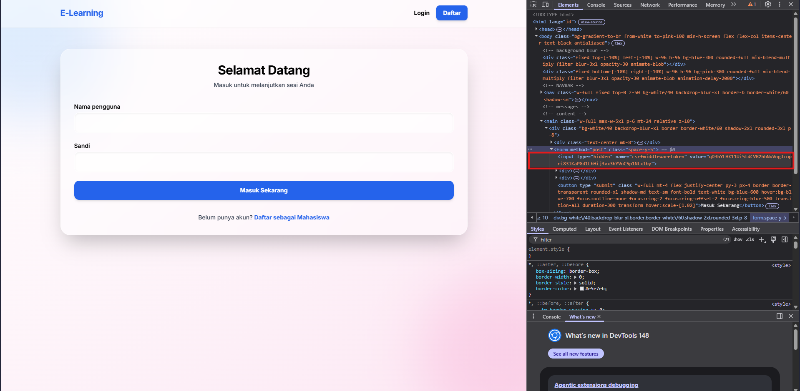
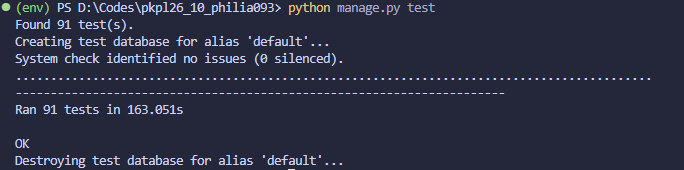

# Tugas 3: Secure Coding Implementation

## Kelas: PKPL C

## Nama Kelompok: PhiLia093

**Anggota Kelompok:**

- Nathanael Leander Herdanatra (2406421320)
- Raihana Nur Azizah (2406413426)
- Rochelle Marchia Arisandi (2406429014)
- Dibrienna Rauseuky (2406429834)
- Ardyana Feby Pratiwi (2406398274)

## Cara Menjalankan Proyek

Persyaratan: Versi Python 3.12+

1. Clone repository ini.

2. Navigasi ke direktori proyek dan buat lingkungan virtual (virtual environment):

    **Untuk Windows:**

    ```powershell
    python -m venv env
    ```

    **Untuk Unix/Linux atau MacOS:**

    ```bash
    python3 -m venv env
    ```

3. Aktifkan lingkungan virtual:

    **Untuk Windows:**

    ```powershell
     env\Scripts\activate
    ```

    **Untuk Unix/Linux atau MacOS:**

    ```bash
    source env/bin/activate
    ```

4. Instal dependensi yang diperlukan:

    ```bash
    pip install -r requirements.txt
    ```

5. Copy file `.env.example` menjadi `.env` dan isi dengan konfigurasi yang sesuai (seperti kunci untuk akses registrasi dosen dan asdos, secret key, dan debug mode). Untuk secret key merupakan string 50 karakter random, dapat di-generate dari [sini](https://djecrety.ir/).

6. Migrasi database:
    ```bash
    python manage.py migrate
    ```
7. Jalankan server development:
    ```bash
    python manage.py runserver
    ```
8. Buka URL localhost yang disediakan di terminal (biasanya http://127.0.0.1:8000) di browser web Anda untuk melihat aplikasi berjalan.

## Cara Registrasi dan Login sebagai Staff (Dosen/Asisten Dosen)

Untuk keamanan, login untuk staf (dosen dan asisten dosen) memerlukan kode akses khusus yang harus dimasukkan saat login, dan URL ini hanya dapat diakses melalui akses langsung di browser (tidak di-link dari halaman lain). Berikut langkah-langkahnya:

1. Pastikan Anda sudah memiliki akun staf yang terdaftar. Jika belum, Anda dapat mendaftar melalui halaman registrasi staf di URL: http://localhost:8000/accounts/portal-register-staff/. Saat registrasi, Anda akan diminta untuk memasukkan kode akses yang sesuai (kode akses untuk dosen atau asisten dosen). Kode ini terletak di file `.env` sebagai `DOSEN_CODE` untuk dosen dan `ASDOS_CODE` untuk asisten dosen.
2. Setelah berhasil mendaftar, Anda dapat login melalui halaman login staf di URL: http://localhost:8000/accounts/portal-login-staff/. Di halaman login ini, selain memasukkan username dan password, Anda juga harus memasukkan kode akses yang sesuai dengan peran Anda (dosen atau asisten dosen).

---

## 1. Deskripsi Aplikasi

Aplikasi ini merupakan sistem **E-Learning University System**. Fitur utama yang diimplementasikan meliputi manajemen _upload_ tugas, input dan pencarian nilai mahasiswa, serta forum diskusi. Sistem ini dirancang dengan mendukung tiga peran (_role_) pengguna yang terisolasi: Dosen, Asisten Dosen, dan Mahasiswa. Sesuai dengan spesifikasi teknis tugas, aplikasi ini dibangun menggunakan framework **Django** berbasis bahasa Python dengan _backend_ database **SQLite**.

## 2. Implementasi Secure Coding

### A. Code Injection Prevention

- **Vulnerability:** _Cross-Site Scripting_ (CWE-79). Celah ini memungkinkan penyerang untuk mengeksekusi kode berbahaya (_script_) yang disisipkan melalui input pengguna.
- **Teknik Mitigasi:** Melakukan validasi semua inpsut pengguna dan murni memanfaatkan fitur _auto-escaping_ bawaan dari sistem _template_ Django. Hal ini mencegah _render_ _raw tag_ HTML/JavaScript di halaman _browser_ dan mengubahnya menjadi entitas yang aman.
- **Snippet Sebelum (Vulnerable):**
    ```html
    {{ post.content|safe }}
    ```
- **Snippet Sesudah (Secure):**
    ```html
    {{ post.content }}
    ```

### B. Broken Authentication

- **Vulnerability:** _Improper Restriction of Excessive Authentication Attempts_ (CWE-307) dan _Use of Hard-coded Credentials_ (CWE-798).
- **Teknik Mitigasi**:
    - Rate Limiting: Akun atau form login akan terkunci selama durasi waktu tertentu apabila terdapat minimal 5 kali percobaan login yang gagal berturut-turut untuk mencegah brute-force.
    - Memastikan token sesi pengguna dihasilkan secara acak dan aman, serta memiliki masa berlaku yang terbatas.
    - Kredensial rahasia (seperti kode akses staf) dipindahkan ke Environment Variables (`.env`) agar terhindar dari plaintext storage di source code.
    - Menyimpan kata sandi (password) pengguna menggunakan metode hashing bawaan PBKDF2 milik Django.
- **Snippet Sebelum (Vulnerable):**
    ```python
    # Kredensial hardcoded pada file sumber
    if access_code == "contoh_kode_akses":
        user.role = 'dosen'
    ```
- **Snippet Sesudah (Secure):**
    ```python
    # Dipanggil dengan aman melalui Environment Variables (.env)
    from django.conf import settings
    if code == settings.DOSEN_ACCESS_CODE:
        user.role = 'dosen'
    ```

### C. CSRF (_Cross-Site Request Forgery_)

- **Vulnerability:** _Cross-Site Request Forgery_ (CWE-352). Celah keamanan di mana instruksi yang tidak sah dikirim dari pengguna yang dipercaya (terautentikasi) ke server.
- **Teknik Mitigasi:** Menyertakan komponen token anti-CSRF (``) pada setiap form HTML yang memicu modifikasi data (metode POST). Django memverifikasi token ini secara otomatis sebelum memproses request apa pun di sisi server.
- **Snippet Sebelum (Vulnerable):**
    ```html
    <form method="POST" action="/assignment/upload/">
        <button type="submit">Upload Tugas</button>
    </form>
    ```
- **Snippet Sesudah (Secure):**
    ```html
    <form method="POST" action="/assignment/upload/">
        
        <button type="submit">Upload Tugas</button>
    </form>
    ```

### D. SQL / Database Injection

- **Vulnerability:** _Improper Neutralization of Special Elements used in an SQL Command_ (CWE-89). Serangan manipulasi query database melalui input pengguna.
- **Teknik Mitigasi:** Menghilangkan eksekusi raw query yang menggunakan prinsip string concatenation. Seluruh pertukaran data diaplikasikan via Django ORM yang secara alamiah menggunakan pendekatan parameterized queries.
- **Snippet Sebelum (Vulnerable):**
    ```python
    # Penggunaan raw string SQL rentan injeksi
    query = "SELECT * FROM assignment_tugas WHERE title = '" + input_judul + "'"
    ```
- **Snippet Sesudah (Secure):**
    ```python
    # ORM memisahkan query dan data (parameterized)
    tugas = Tugas.objects.filter(title=input_judul)
    ```

## 3. Screenshot Aplikasi

### Landing Page (Dashboard



### Login Rate Limiting



### XSS Prevention



### CSRF Protection



## 4. Test Runs


Hasil test menunjukkan bahwa semua pengujian unit berhasil tanpa kegagalan, menandakan bahwa fitur-fitur utama aplikasi berfungsi dengan baik dan tidak ada regresi yang terjadi setelah implementasi mitigasi keamanan.

[Test log](tests.log)

## 5. Link Video Demo

[https://youtu.be/CLKqUj51pQc](https://youtu.be/CLKqUj51pQc)
